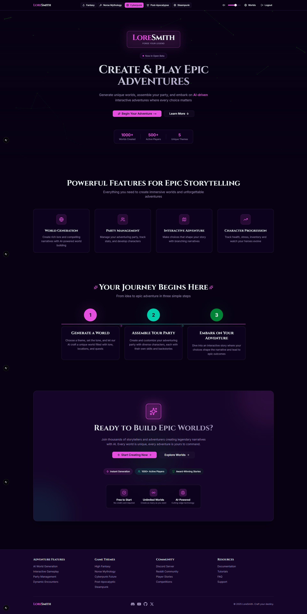

[](https://golang.org/)
[](https://www.python.org/)
[](https://nextjs.org/)
[](https://www.langchain.com/)
[](https://langfuse.com/)
[](https://grpc.io/)
[](https://www.docker.com/)
[](https://www.postgresql.org/)
[](https://redis.io/)

<p align="center">
  
</p>

## What is LoreSmith?

LoreSmith is an **interactive adventure platform** where AI generates rich, thematic worlds and transforms them into playable text-based games. Create characters, explore dynamic settings, and embark on AI-driven adventures with party management, inventory systems, and branching narratives—all powered by advanced language models.

## Screenshots

### Home Page


_Welcome screen with theme selection and navigation_

### Lore Generation Cards


_Interactive cards for generating world elements (characters, factions, settings, etc.)_

### Full Story View


_Complete generated story with quest details and narrative_

### Search Page


_Search page with filters_

> **Note**: Screenshots show the current development state. UI and features may evolve.

## Architecture

**Microservices Design**: Go handles HTTP/auth/sessions/game state, Python handles AI generation and narrative processing  
**AI-Driven**: Flexible AI provider (local Ollama or cloud OpenRouter) with custom prompt chains for world coherence  
**Session Management**: Redis-based game state persistence and caching  
**Scalable**: Docker orchestration with observability (Prometheus, Langfuse)

## Search System

LoreSmith features advanced AI-powered search combining semantic and keyword matching:

1. **Query Processing**: User queries are preprocessed (LLM expansion for thematic searches, skipped for exact terms)
2. **Vector Search**: PostgreSQL with pgvector finds semantically similar worlds via embeddings
3. **Fusion Retrieval**: Combines vector similarity with BM25 keyword scoring for robust relevance
4. **Diversity Reranking**: Dartboard algorithm ensures varied results, preventing similar worlds from dominating

This hybrid approach enables both thematic exploration ("desert oasis with pyramids") and precise lookups ("Eira Flynn").

## Key Features

### AI-Powered World Creation

- **Thematic Generation**: Create lore for multiple genres (post-apocalyptic, fantasy, cyberpunk, etc.)
- **Narrative Coherence**: Full story generation weaves disconnected pieces into coherent worlds
- **Dynamic Content**: AI generates contextual encounters and branching storylines

### Interactive Adventures

- **Party Management**: Character selection, health/stress tracking, inventory systems
- **Dynamic Encounters**: AI generates contextual encounters based on established world lore
- **Session Persistence**: Save/resume adventures with full game state management

## Tech Stack

- **Frontend**: Next.js, TypeScript, Tailwind CSS, Zustand, TanStack Query
- **Go Service**: HTTP server, JWT auth, Chi router
- **Python Service**: gRPC server with LangChain prompt chains for structured AI generation
  - **LangChain**: LCEL chains for composable prompt workflows and output parsing
  - **Langfuse**: Cloud-based observability for LLM tracing, token tracking, and performance monitoring
- **AI Providers**: Ollama (local models) or OpenRouter (cloud models)
- **Database**: PostgreSQL (users/world data) with pgvector (vector embeddings), Redis (sessions/caching)
- **Deployment**: Docker Compose with multi-service orchestration

## Getting Started

### Prerequisites

- Docker and Docker Compose
- **Choose ONE of the following AI providers:**
  - **Option A (Recommended for Development)**: Ollama + Local LLM (free, unlimited)
  - **Option B (Production/Higher Quality)**: OpenRouter API key (paid per request)

### AI Provider Setup

#### Option A: Local AI with Ollama (FREE)

1. **Install Ollama:**

   ```bash
   curl -fsSL https://ollama.com/install.sh | sh
   ```

2. **Download a model:**

   ```bash
   ollama pull llama3.1:8b
   ```

3. **Configure .env:**
   ```env
   AI_PROVIDER=local
   LOCAL_MODEL=llama3.1:8b
   OLLAMA_URL=http://host.docker.internal:11434
   ```

**Recommended Models:**

- `llama3.1:8b` - Best overall quality (4.9GB)
- `mistral:7b` - Fast, creative (4.1GB)
- `gemma2:9b` - Good for narrative (5.4GB)

#### Option B: Cloud AI with OpenRouter (PAID)

1. **Get API key:** https://openrouter.ai/

2. **Configure .env:**
   ```env
   AI_PROVIDER=openrouter
   OPENROUTER_API_KEY=your_api_key_here
   ```

### Setup

1. Copy `.env.example` to `.env` and configure your values:

   See `.env.example` for all required environment variables including database config, AI provider settings, Langfuse observability, and frontend authentication.

2. Run:

   ```bash
   docker-compose up --build
   ```

   > **Alternative**: Use the provided Makefile for convenience:
   >
   > ```bash
   > make docker-dev
   > ```
   >
   > Check `Makefile` for additional commands like `make test`, `make lint`, etc.

3. Access:
   - API: http://localhost:8080
   - Health: http://localhost:8080/health

## API Reference

The platform uses a REST API for user authentication and internal operations. Key endpoints include:

- `POST /register` - User registration
- `POST /login` - User authentication
- `GET /generate/*` - AI-powered content generation
- `GET/POST /worlds/*` - Worlds management

For development details, see the Go service source code.

## How It Works

### Adventure Creation Flow

1. **World Generation**: AI creates thematic lore pieces using custom prompt chains
2. **Story Weaving**: Full story generation connects pieces into coherent narratives
3. **Party Assembly**: Choose characters from generated cast with unique attributes
4. **Adventure Launch**: Enter the world with dynamic encounters and player choices
5. **State Management**: Track health, stress, inventory, and story progress across sessions

## Development Roadmap

### Current Status

- ✅ Core lore generation system
- ✅ Full story narrative weaving
- ✅ Microservices architecture
- ✅ Web interface with search and generation
- 🔄 AI evaluation and output polishing
- 🔄 Interactive adventure engine (core implementation)
- 🔄 Party management and character systems

### Planned Features

- **Enhanced Adventure UI**: Multi-panel interface with visual components and maps
- **Advanced AI Encounters**: More sophisticated contextual storytelling and choices
- **Inventory & Crafting**: Item management, equipment, and crafting systems
- **Faction Dynamics**: Reputation tracking, political consequences, alliances
- **Environmental Systems**: Weather, hazards, resource management
- **Multiplayer Support**: Shared adventures, cooperative gameplay

## CI/CD

GitHub Actions handle linting (Ruff/Black), testing, and Docker image builds on pushes/PRs.
