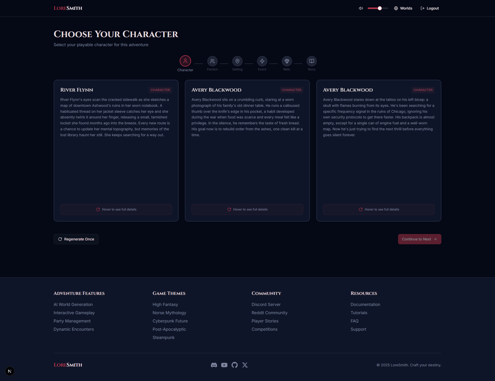
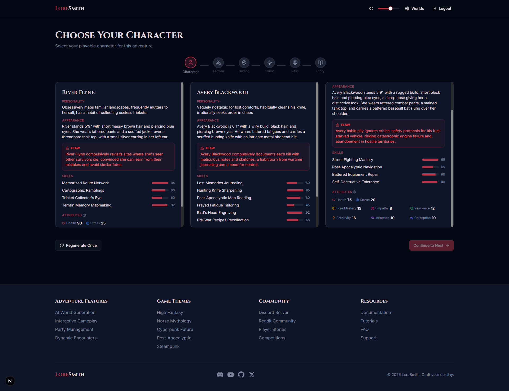
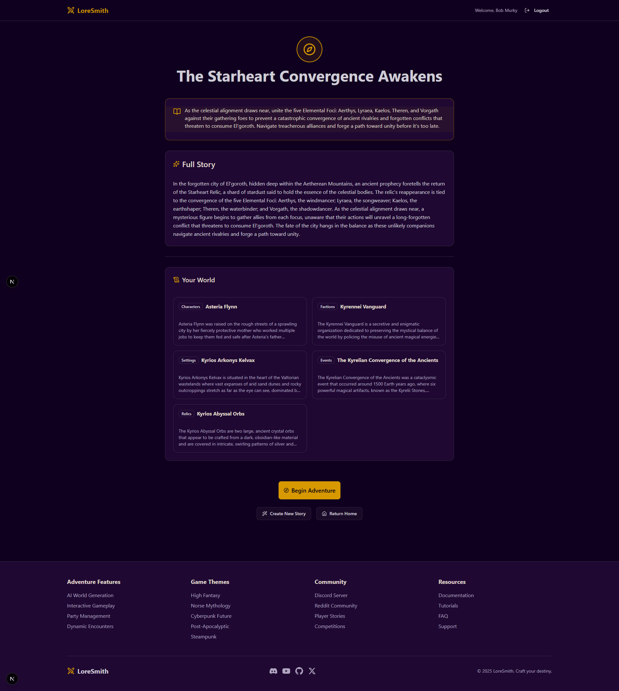

[](https://golang.org/)
[](https://www.python.org/)
[](https://nextjs.org/)
[](https://www.langchain.com/)
[](https://langfuse.com/)
[](https://grpc.io/)
[](https://www.docker.com/)
[](https://www.postgresql.org/)
[](https://redis.io/)

## What is LoreSmith?

LoreSmith is an **interactive adventure platform** where AI generates rich, thematic worlds and transforms them into playable text-based games. Create characters, explore dynamic settings, and embark on AI-driven adventures with party management, inventory systems, and branching narratives—all powered by advanced language models.

## Screenshots

### Home Page

### Discover Worlds Page


_Discover page view_

### My Worlds Page


_My Worlds page view_

### Lore Generation Cards(Front)


_Interactive cards for generating world elements (characters, factions, settings, etc.)_

### Lore Generation Cards(Back)


_Interactive cards for generating world elements (characters, factions, settings, etc.)_

### Full Story View


_Complete generated story with quest details and narrative_

> **Note**: Screenshots show the current development state. UI and features may evolve.

## Architecture

**Microservices Design**: Go handles HTTP/auth/sessions/game state, Python handles AI generation and narrative processing  
**AI-Driven**: Flexible AI provider (local Ollama or cloud OpenRouter) with custom prompt chains for world coherence  
**Session Management**: Redis-based game state persistence and caching  
**Scalable**: Docker orchestration with observability (Prometheus, Langfuse)

## Search System

LoreSmith features advanced AI-powered search combining semantic and keyword matching:

1. **Query Processing**: User queries are preprocessed (LLM expansion for thematic searches, skipped for exact terms)
2. **Vector Search**: PostgreSQL with pgvector finds semantically similar worlds via embeddings
3. **Fusion Retrieval**: Combines vector similarity with BM25 keyword scoring for robust relevance
4. **Diversity Reranking**: Dartboard algorithm ensures varied results, preventing similar worlds from dominating

This hybrid approach enables both thematic exploration ("desert oasis with pyramids") and precise lookups ("Eira Flynn").

## Key Features

### AI-Powered World Creation

- **Thematic Generation**: Create lore for multiple genres (post-apocalyptic, fantasy, cyberpunk, etc.)
- **Narrative Coherence**: Full story generation weaves disconnected pieces into coherent worlds
- **Dynamic Content**: AI generates contextual encounters and branching storylines

### Interactive Adventures

- **Party Management**: Character selection, health/stress tracking, inventory systems
- **Dynamic Encounters**: AI generates contextual encounters based on established world lore
- **Session Persistence**: Save/resume adventures with full game state management

## Tech Stack

- **Frontend**: Next.js, TypeScript, Tailwind CSS, Zustand, TanStack Query
- **Go Service**: HTTP server, JWT auth, Chi router
- **Python Service**: gRPC server with LangChain prompt chains for structured AI generation
  - **LangChain**: LCEL chains for composable prompt workflows and output parsing
  - **Langfuse**: Cloud-based observability for LLM tracing, token tracking, and performance monitoring
- **AI Providers**: Ollama (local models) or OpenRouter (cloud models)
- **Database**: PostgreSQL (users/world data) with pgvector (vector embeddings), Redis (sessions/caching)
- **Deployment**: Docker Compose with multi-service orchestration

## Getting Started

### Prerequisites

- Docker and Docker Compose
- **Choose ONE of the following AI providers:**
  - **Option A (Recommended for Development)**: Ollama + Local LLM (free, unlimited)
  - **Option B (Production/Higher Quality)**: OpenRouter API key (paid per request)

### AI Provider Setup

#### Option A: Local AI with Ollama (FREE)

1. **Install Ollama:**

   ```bash
   curl -fsSL https://ollama.com/install.sh | sh
   ```

2. **Download a model:**

   ```bash
   ollama pull llama3.1:8b
   ```

3. **Configure .env:**
   ```env
   AI_PROVIDER=local
   LOCAL_MODEL=llama3.1:8b
   OLLAMA_URL=http://host.docker.internal:11434
   ```

**Recommended Models:**

- `llama3.1:8b` - Best overall quality (4.9GB)
- `mistral:7b` - Fast, creative (4.1GB)
- `gemma2:9b` - Good for narrative (5.4GB)

#### Option B: Cloud AI with OpenRouter (PAID)

1. **Get API key:** https://openrouter.ai/

2. **Configure .env:**
   ```env
   AI_PROVIDER=openrouter
   OPENROUTER_API_KEY=your_api_key_here
   ```

### Character Image Generation (Optional)

LoreSmith can generate AI portrait images for characters (1024x1024). Choose between cloud or local generation:

#### Option A: Cloud Generation with Replicate (PAID, High Quality)

Uses Stable Diffusion XL via Replicate API - professional quality, no local setup required.

1. **Get API Token**: https://replicate.com/account/api-tokens

   - New accounts get $5 free credits (~500-600 images)
   - Pricing: ~$0.008-0.01 per image after free credits

2. **Configure .env:**
   ```env
   ENABLE_IMAGE_GENERATION=true
   IMAGE_PROVIDER=replicate
   REPLICATE_API_TOKEN=your_token_here
   ```

**Performance**: ~30-60 seconds per character

#### Option B: Local Generation with Automatic1111 (FREE, Customizable)

Run Stable Diffusion locally - completely free, full control over models and settings.

1. **Install Automatic1111 WebUI** (in WSL2 or native Linux):

   ```bash
   cd ~
   git clone https://github.com/AUTOMATIC1111/stable-diffusion-webui.git
   cd stable-diffusion-webui

   # Start with API enabled (keeps terminal window open)
   ./webui.sh --api --listen --skip-torch-cuda-test
   ```

   First run downloads SD 1.5 (~4GB, takes 5-10 minutes).

2. **Download Better Model** (recommended - SDXL-Turbo):

   Open a second terminal:

   ```bash
   cd ~/stable-diffusion-webui/models/Stable-diffusion/

   # Download SDXL-Turbo (~7GB, much better quality)
   wget https://huggingface.co/stabilityai/sdxl-turbo/resolve/main/sd_xl_turbo_1.0_fp16.safetensors
   ```

   Then select it in the Web UI:

   - Open http://localhost:7860
   - Top-left dropdown: Select `sd_xl_turbo_1.0_fp16.safetensors`
   - Wait 10-15 seconds for model to load

3. **Configure .env:**
   ```env
   ENABLE_IMAGE_GENERATION=true
   IMAGE_PROVIDER=local
   AUTOMATIC1111_URL=http://host.docker.internal:7860
   ```

**Performance**:

- SD 1.5 (default): ~20-30 seconds per character, decent quality
- SDXL-Turbo: ~10-15 seconds per character, very good quality

**Running Automatic1111 in the Future**:

Automatic1111 needs to be running when generating characters (unlike Ollama daemon). You have options:

**Option 1: Keep Terminal Open (Simple)**

```bash
cd ~/stable-diffusion-webui
./webui.sh --api --listen --skip-torch-cuda-test
```

Leave this terminal running while using LoreSmith.

**Option 2: Run in Background (Convenient)**

```bash
cd ~/stable-diffusion-webui
nohup ./webui.sh --api --listen --skip-torch-cuda-test > webui.log 2>&1 &
```

To stop: `pkill -f webui.sh`

**Option 3: Use tmux/screen (Best for SSH)**

```bash
tmux new -s webui
cd ~/stable-diffusion-webui
./webui.sh --api --listen --skip-torch-cuda-test
# Press Ctrl+B, then D to detach
# Reattach later: tmux attach -t webui
```

**How Model Selection Works**:

- Whatever model is selected in the Web UI dropdown gets used for API calls
- Our code calls Automatic1111's API with generation parameters (steps, guidance, etc.)
- UI settings (like denoising strength, etc.) **don't** apply to API calls
- API parameters are in `python-service/services/image_generator.py`

**Customizing Image Generation**:

Edit `python-service/services/image_generator.py` to tweak:

- `num_inference_steps`: Higher = better quality, slower (default: 20)
- `cfg_scale`: Prompt adherence strength (default: 7.5)
- `sampler_name`: Algorithm used (default: "DPM++ 2M Karras")
- Theme-specific prompts and negative prompts

**Recommended Models**:

- **SD 1.5** (default): 4GB, fast but dated quality
- **SDXL-Turbo**: 7GB, best balance of speed/quality for testing
- **SDXL Base 1.0**: 13GB, highest quality but slower (~60s per character)

**Daily Usage - Quick Commands**:

```bash
# Start Automatic1111 (keep terminal open)
cd ~/stable-diffusion-webui
./webui.sh --api --listen --skip-torch-cuda-test

# OR run in background (recommended)
cd ~/stable-diffusion-webui
nohup ./webui.sh --api --listen --skip-torch-cuda-test > webui.log 2>&1 &

# Check if running
ps aux | grep webui.sh
# OR check the API
curl http://localhost:7860/sdapi/v1/sd-models

# Stop background process
pkill -f webui.sh

# View logs (if running in background)
tail -f ~/stable-diffusion-webui/webui.log

# Switch models:
# 1. Open http://localhost:7860
# 2. Top-left dropdown: Select model (e.g., sd_xl_turbo_1.0_fp16)
# 3. Wait 10-15 seconds for model to load
# 4. Generate character in LoreSmith - uses selected model
```

**Important Notes**:

- Automatic1111 **must be running** when generating characters (unlike Ollama)
- Whatever model is selected in the Web UI dropdown gets used for API calls
- UI settings (sliders, checkboxes) don't apply to API calls
- To customize generation parameters, edit `python-service/services/image_generator.py`
- Images saved to `frontend/public/generated/` (gitignored)

**Troubleshooting**:

```bash
# Can't connect to Automatic1111
# → Check it's running with --api flag
curl http://localhost:7860/sdapi/v1/sd-models

# Images not appearing in frontend
# → Check Docker volume mount exists
ls frontend/public/generated/0/

# Generation too slow
# → Use SDXL-Turbo instead of SDXL Base
# → Reduce steps in image_generator.py (20 → 8 for turbo models)

# Out of memory
# → Use smaller model (SD 1.5 instead of SDXL)
# → Reduce batch size or image dimensions in code
```

#### Disable Image Generation

To turn off image generation entirely:

```env
ENABLE_IMAGE_GENERATION=false
```

### Asset Storage with Cloudflare R2

LoreSmith uses **Cloudflare R2** (S3-compatible object storage) to store generated assets like character portraits. This keeps your database lightweight and provides fast CDN delivery.

**How it works:**

1. **During character generation**: Images are created as base64 strings (no storage yet - world doesn't exist)
2. **After world creation**: Images are automatically uploaded to R2 and the database stores only the public URL
3. **On world pages**: Images load directly from Cloudflare's CDN for fast global delivery

**What's stored in R2:**

- ✅ **Character portraits** (1024x1024)
- ✅ **Background music** (theme-specific ambient tracks)

**Setup R2 storage (optional but recommended):**

1. **Create R2 bucket**: [Cloudflare Dashboard](https://dash.cloudflare.com/) → R2 → Create bucket (`loresmith-portraits`)
2. **Generate API token**: R2 → Manage R2 API Tokens → Create API Token (read/write permissions)
3. **Enable public access**: Bucket Settings → Public Access → Connect custom domain or use R2.dev subdomain

4. **Configure .env:**
   ```env
   # R2 credentials (from Cloudflare dashboard)
   AWS_ACCESS_KEY_ID=your_access_key_id
   AWS_SECRET_ACCESS_KEY=your_secret_access_key
   AWS_ENDPOINT_URL=https://your_account_id.r2.cloudflarestorage.com
   R2_PORTRAITS_BUCKET_NAME=loresmith-portraits
   R2_PORTRAITS_PUBLIC_URL=https://pub-your_bucket_id.r2.dev
   NEXT_PUBLIC_R2_MUSIC_PUBLIC_URL=https://pub-your_bucket_id.r2.dev
   ```

**Without R2**: Images still generate but won't persist after world creation. Characters will display during generation preview only.

**Storage pattern**: `portraits/{world_id}/{character_id}_portrait.png`

### Setup

1. Copy `.env.example` to `.env` and configure your values:

   See `.env.example` for all required environment variables including database config, AI provider settings, Langfuse observability, and frontend authentication.

2. Run:

   ```bash
   docker-compose up --build
   ```

   > **Alternative**: Use the provided Makefile for convenience:
   >
   > ```bash
   > make docker-dev
   > ```
   >
   > Check `Makefile` for additional commands like `make test`, `make lint`, etc.

3. Access:
   - API: http://localhost:8080
   - Health: http://localhost:8080/health

## API Reference

The platform uses a REST API for user authentication and internal operations. Key endpoints include:

- `POST /register` - User registration
- `POST /login` - User authentication
- `GET /generate/*` - AI-powered content generation
- `GET/POST /worlds/*` - Worlds management

For development details, see the Go service source code.

## How It Works

### Adventure Creation Flow

1. **World Generation**: AI creates thematic lore pieces using custom prompt chains
2. **Story Weaving**: Full story generation connects pieces into coherent narratives
3. **Party Assembly**: Choose characters from generated cast with unique attributes
4. **Adventure Launch**: Enter the world with dynamic encounters and player choices
5. **State Management**: Track health, stress, inventory, and story progress across sessions

## Development Roadmap

### Current Status

- ✅ Core lore generation system
- ✅ Full story narrative weaving
- ✅ Microservices architecture
- ✅ Web interface with search and generation
- 🔄 AI evaluation and output polishing
- 🔄 Interactive adventure engine (core implementation)
- 🔄 Party management and character systems

### Planned Features

- **Enhanced Adventure UI**: Multi-panel interface with visual components and maps
- **Advanced AI Encounters**: More sophisticated contextual storytelling and choices
- **Inventory & Crafting**: Item management, equipment, and crafting systems
- **Faction Dynamics**: Reputation tracking, political consequences, alliances
- **Environmental Systems**: Weather, hazards, resource management
- **Multiplayer Support**: Shared adventures, cooperative gameplay

## CI/CD

GitHub Actions handle linting (Ruff/Black), testing, and Docker image builds on pushes/PRs.
