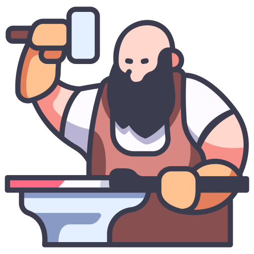

[](https://golang.org/)
[](https://www.python.org/)
[](https://grpc.io/)
[](https://www.docker.com/)
[](https://www.postgresql.org/)
[](https://redis.io/)

<p align="center">
  
</p>

An AI-powered narrative game engine that transforms generated lore into interactive adventures. Built with Go microservices and Python AI chains, featuring world generation, party management, and session-based gameplay.

## What is LoreSmith?

LoreSmith is a **dual-purpose platform**:

1. **World Building API**: Generate cohesive lore (characters, factions, settings, events, relics) for storytelling and tabletop gaming
2. **Interactive Adventure Engine**: Transform generated worlds into playable text-based adventures with party management, inventory systems, and AI-driven encounters

## Architecture

**Microservices Design**: Go handles HTTP/auth/sessions/game state, Python handles AI generation and narrative processing  
**AI-Driven**: Flexible AI provider (local Ollama or cloud OpenRouter) with custom prompt chains for world coherence  
**Session Management**: Redis-based game state persistence and caching  
**Scalable**: Docker orchestration with observability (Prometheus, Grafana, Sentry)

## Key Features

### World Building (API Mode)

- **Thematic Generation**: Create lore for multiple genres (post-apocalyptic, fantasy, cyberpunk, etc.)
- **Narrative Coherence**: Full story generation weaves disconnected pieces into coherent worlds
- **Flexible Output**: Individual components or complete world bundles

### Adventure Gaming (Interactive Mode)

- **World Initialization**: Generated lore becomes playable adventure setting
- **Party Management**: Character selection, health/stress tracking, inventory systems
- **Dynamic Encounters**: AI generates contextual encounters based on established world lore
- **Session Persistence**: Save/resume adventures with full game state management

## Tech Stack

- **Go Service**: HTTP server, JWT auth, Chi router, session management, game state logic
- **Python Service**: gRPC server, AI chains, narrative processing, OpenRouter client
- **Database**: PostgreSQL (users/world data), Redis (sessions/caching)
- **Deployment**: Docker Compose with multi-service orchestration

## Getting Started

### Prerequisites

- Docker and Docker Compose
- **Choose ONE of the following AI providers:**
  - **Option A (Recommended for Development)**: Ollama + Local LLM (free, unlimited)
  - **Option B (Production/Higher Quality)**: OpenRouter API key (paid per request)

### AI Provider Setup

#### Option A: Local AI with Ollama (FREE)

1. **Install Ollama:**

   ```bash
   curl -fsSL https://ollama.com/install.sh | sh
   ```

2. **Download a model:**

   ```bash
   ollama pull llama3.1:8b
   ```

3. **Configure .env:**
   ```env
   AI_PROVIDER=local
   LOCAL_MODEL=llama3.1:8b
   OLLAMA_URL=http://host.docker.internal:11434
   ```

**Recommended Models:**

- `llama3.1:8b` - Best overall quality (4.9GB)
- `mistral:7b` - Fast, creative (4.1GB)
- `gemma2:9b` - Good for narrative (5.4GB)

#### Option B: Cloud AI with OpenRouter (PAID)

1. **Get API key:** https://openrouter.ai/

2. **Configure .env:**
   ```env
   AI_PROVIDER=openrouter
   OPENROUTER_API_KEY=your_api_key_here
   ```

### Setup

1. Copy `.env.example` to `.env` and configure:

   ```env
   # Choose your AI provider (see above)
   AI_PROVIDER=local  # or "openrouter"

   # If using local:
   LOCAL_MODEL=llama3.1:8b
   OLLAMA_URL=http://host.docker.internal:11434

   # If using OpenRouter:
   OPENROUTER_API_KEY=your_api_key_here

   # Database config
   POSTGRES_HOST=postgres
   POSTGRES_PORT=5432
   POSTGRES_DB=loresmith
   POSTGRES_USER=loresmithuser
   POSTGRES_PASSWORD=your_password
   REDIS_HOST=redis
   REDIS_PORT=6379
   JWT_SECRET=your_secret
   ```

2. Run:

   ```bash
   docker-compose up --build
   ```

3. Access:
   - API: http://localhost:8080
   - Health: http://localhost:8080/health

## API Usage

### World Building Endpoints

All generation endpoints require JWT auth (except `/health`, `/register`, `/login`).

**Authentication:**

- `POST /register` - Register user
- `POST /login` - Login and receive JWT token

**Lore Generation:**

- `GET /generate/characters` - Generate character profiles
- `GET /generate/factions` - Generate faction descriptions
- `GET /generate/settings` - Generate location details
- `GET /generate/events` - Generate historical events
- `GET /generate/relics` - Generate artifact descriptions
- `GET /generate/all` - Generate complete world bundle
- `POST /generate/full-story` - Create narrative from selected lore pieces

**Query Parameters:**

- `count`: Number of items (1-10)
- `theme`: World theme (post-apocalyptic, fantasy, cyberpunk, etc.)
- `regenerate`: Skip cache for fresh generation

### Adventure Gaming Endpoints

**Adventure Management:**

- `POST /adventure/initialize` - Create new adventure world
- `POST /adventure/start` - Begin adventure with selected party
- `GET /adventure/encounter` - Get current encounter and choices
- `POST /adventure/choice` - Process player decision
- `GET /adventure/status` - Get current game state

**Example World Generation Response:**

```json
{
  "characters": [
    {
      "name": "Echo",
      "description": "A skilled scavenger navigating ruins...",
      "details": {
        "personality": "Cautious, intelligent, burdened by past",
        "appearance": "Dust-covered cloak, reflective goggles",
        "health": 100,
        "stress": 20,
        "skills": ["scavenging", "stealth", "tech-savvy"]
      }
    }
  ],
  "full_story": {
    "title": "The Last Signal",
    "content": "In Ashfall City, Echo discovers the Pathseeker Map while avoiding the militant Steel Reclaimers..."
  }
}
```

## How It Works

### World Building Flow

1. **Generation**: AI creates thematic lore pieces using custom prompt chains
2. **Coherence**: Full story generation weaves pieces into narrative
3. **Caching**: Redis stores results for performance
4. **Export**: JSON API or adventure initialization

### Adventure Gaming Flow

1. **Initialization**: Generate world bundle → create full story → establish context
2. **Party Selection**: Choose characters from generated cast
3. **Session Creation**: Store world context and party state in Redis
4. **Adventure Loop**: Generate encounters → present choices → update state → repeat
5. **State Management**: Track health, stress, inventory, relationships, world progress

## Development Roadmap

### Current Status

- ✅ Core lore generation system
- ✅ Full story narrative weaving
- ✅ Microservices architecture
- 🔄 Adventure game engine (in development)

### Planned Features

- **Enhanced UI**: Multi-panel adventure interface with visual components
- **Inventory System**: Item management, crafting, trading
- **Faction Dynamics**: Reputation tracking, political consequences
- **Environmental Systems**: Weather, hazards, resource management
- **Multiplayer Support**: Shared adventures, party cooperation

## CI/CD

GitHub Actions handle linting (Ruff/Black), testing, and Docker image builds on pushes/PRs.
